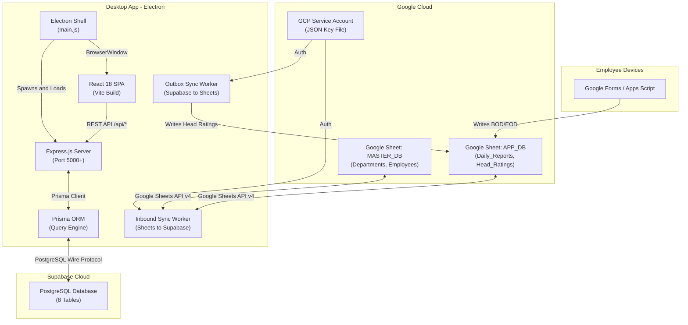
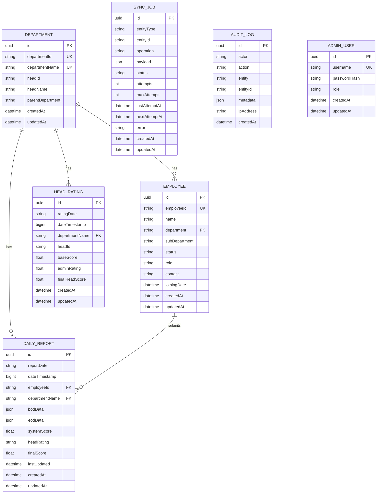
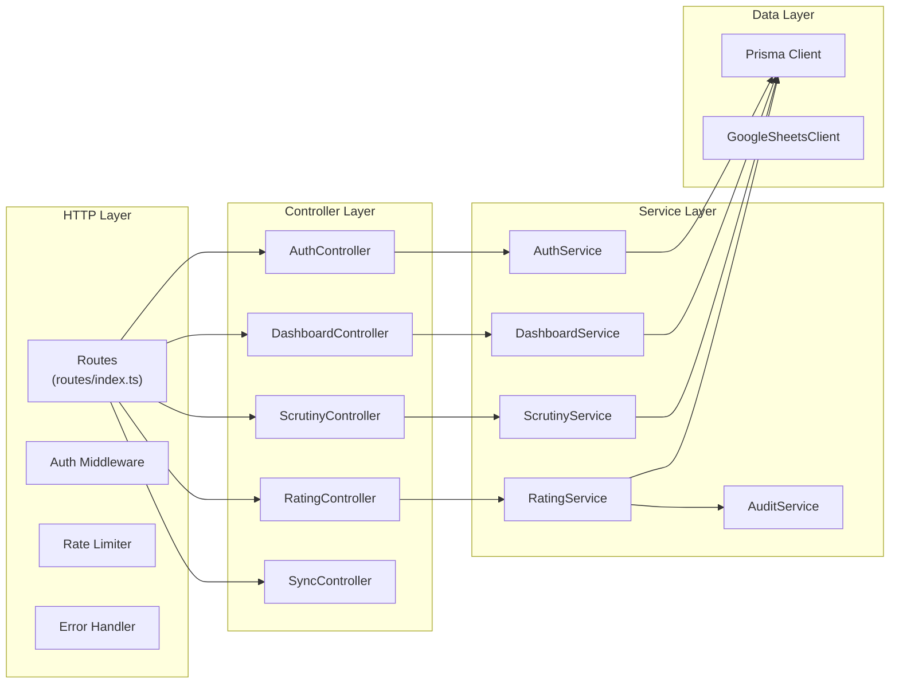
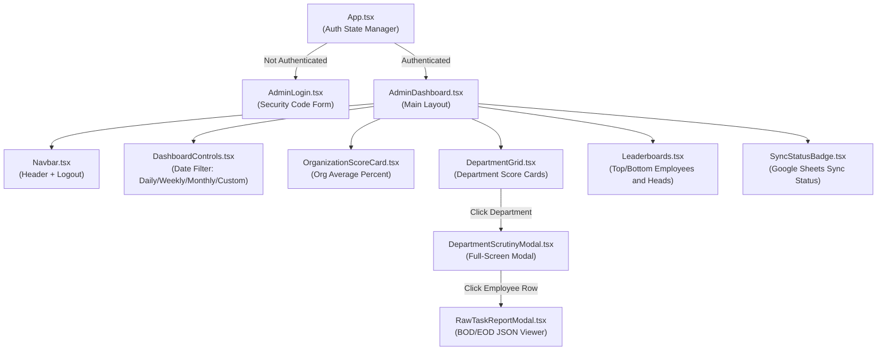
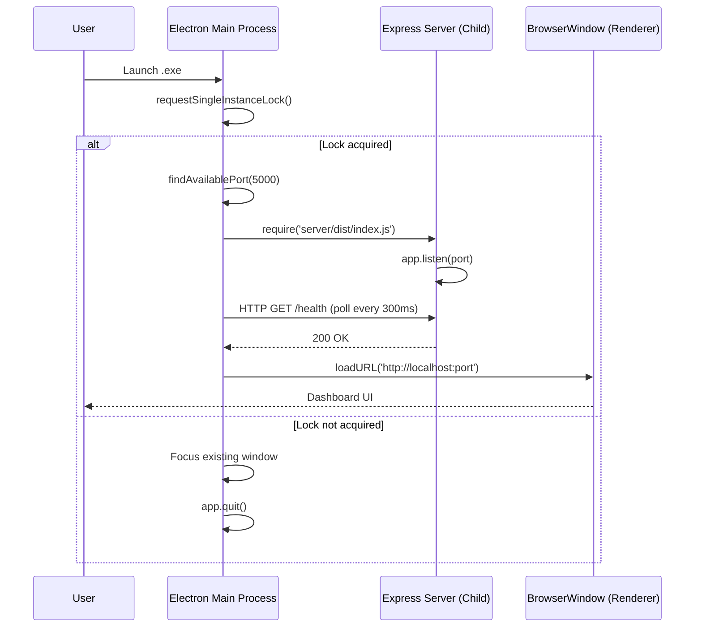
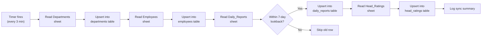
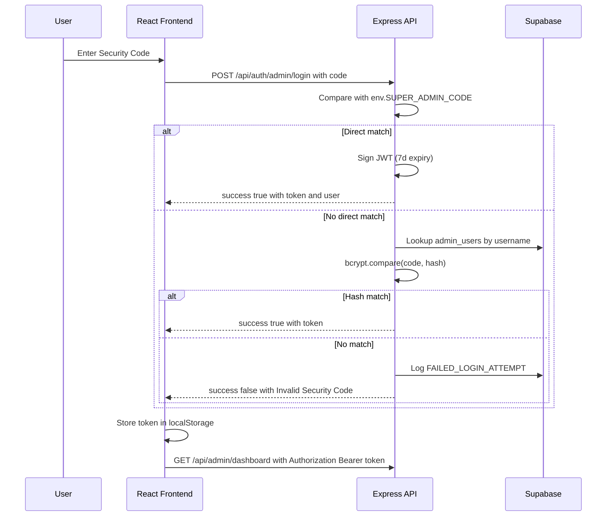
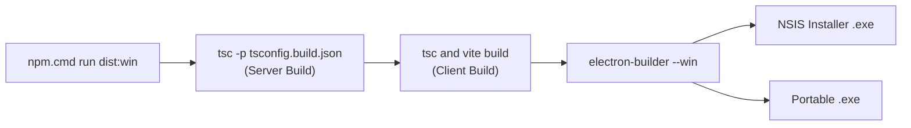

# Technical Design Document
## The Prime Classes — Branch Head & Super Admin Full-Stack Platform

| Field | Value |
|---|---|
| **Document Version** | 1.0 |
| **Date** | 26 August 2026 |
| **Author** | The Prime Classes Development Team |
| **Status** | Production |
| **Platform** | Windows x64 Desktop (Electron) + Web |

---

## Table of Contents

1. [Executive Summary](#1-executive-summary)
2. [System Overview](#2-system-overview)
3. [Architecture](#3-architecture)
4. [Technology Stack](#4-technology-stack)
5. [Data Model](#5-data-model)
6. [Backend Design](#6-backend-design)
7. [Frontend Design](#7-frontend-design)
8. [Electron Desktop Shell](#8-electron-desktop-shell)
9. [Google Sheets Integration](#9-google-sheets-integration)
10. [Scoring Engine](#10-scoring-engine)
11. [Authentication & Security](#11-authentication--security)
12. [API Reference](#12-api-reference)
13. [Deployment & Packaging](#13-deployment--packaging)
14. [Environment Configuration](#14-environment-configuration)
15. [Error Handling & Resilience](#15-error-handling--resilience)
16. [Testing Strategy](#16-testing-strategy)
17. [Directory Structure](#17-directory-structure)
18. [Known Constraints & Limitations](#18-known-constraints--limitations)

---

## 1. Executive Summary

**The Prime Classes — Branch Head & Super Admin Platform** is a full-stack employee performance management system that replaces and extends an existing Google Apps Script application. It enables Branch Heads and a Super Admin to:

- View real-time **BOD (Beginning of Day)** and **EOD (End of Day)** employee performance reports
- Apply **Head Scrutiny Ratings** per department per day
- Apply **Super Admin Ratings** as multipliers on department averages
- View organizational dashboards with leaderboards (top/bottom employees and heads)
- Export PDF reports of department scrutiny data
- Maintain bidirectional sync with the legacy **Google Sheets** data source

The system is delivered as a **Windows desktop application** (`.exe` installer and portable) using Electron, with a **Supabase** cloud PostgreSQL database and automatic Google Sheets synchronization.

---

## 2. System Overview



### Data Flow Summary

| Direction | Source | Destination | Mechanism | Frequency |
|---|---|---|---|---|
| **Inbound** | Google Sheets | Supabase | `SheetsInboundSync` polling | Every 3 minutes |
| **Outbound** | Supabase | Google Sheets | `SheetsSyncWorker` outbox | Every 5 seconds |
| **Read** | Supabase | React Dashboard | REST API (`/api/*`) | On user interaction |
| **Write** | React Dashboard | Supabase | REST API (`PUT /api/admin/...`) | On rating submission |

---

## 3. Architecture

### 3.1 Architectural Pattern

The system follows a **monolithic three-tier architecture** packaged inside Electron:

| Tier | Technology | Responsibility |
|---|---|---|
| **Presentation** | React 18 + Tailwind CSS | SPA dashboard UI |
| **Application** | Express.js + TypeScript | REST API, business logic, sync workers |
| **Data** | PostgreSQL (Supabase) + Prisma ORM | Persistent storage, schema management |

### 3.2 Key Design Decisions

| Decision | Rationale |
|---|---|
| **Supabase over local Docker PostgreSQL** | User requirement — avoid local C: drive storage consumption |
| **Electron for desktop distribution** | Requirement for `.exe` installable on multiple PCs without developer setup |
| **Prisma ORM** | Type-safe database access, auto-generated client, migration support |
| **Google Sheets API v4 (Service Account)** | Legacy system writes to Sheets; bidirectional sync maintains compatibility |
| **Outbox Pattern for writes** | Guarantees eventual consistency for Supabase to Google Sheets sync with retry logic |
| **Polling for inbound sync** | Simpler than webhooks; no public URL needed; 3-minute interval sufficient |
| **JWT-based auth (no session store)** | Stateless authentication; no Redis/session dependency needed |
| **Dynamic port allocation** | Prevents `EADDRINUSE` crashes on machines with port 5000 occupied |

---

## 4. Technology Stack

### 4.1 Backend

| Component | Technology | Version |
|---|---|---|
| Runtime | Node.js | 22.14.0 |
| Framework | Express.js | 4.19.2 |
| Language | TypeScript | 5.5.3 |
| ORM | Prisma Client | 5.18.0 |
| Database | PostgreSQL (Supabase) | 15.x |
| Authentication | jsonwebtoken (JWT) | 9.0.2 |
| Password Hashing | bcryptjs | 2.4.3 |
| Google API | googleapis | 140.0.1 |
| Validation | Zod | 3.23.8 |
| Security | Helmet | 7.1.0 |
| Rate Limiting | express-rate-limit | 7.3.1 |
| Logging | Morgan | 1.10.0 |

### 4.2 Frontend

| Component | Technology | Version |
|---|---|---|
| UI Library | React | 18.3.1 |
| Build Tool | Vite | 5.3.4 |
| Language | TypeScript | 5.5.3 |
| Styling | Tailwind CSS | 3.4.7 |
| Icons | Lucide React | 0.418.0 |
| CSS Utilities | clsx + tailwind-merge | 2.1.1 / 2.4.0 |
| PDF Export | html2pdf.js | 0.10.2 |

### 4.3 Desktop & Packaging

| Component | Technology | Version |
|---|---|---|
| Desktop Framework | Electron | 43.4.1 |
| Installer Builder | electron-builder | 26.15.3 |
| Installer Format | NSIS (installer) + Portable | x64 |
| Server Readiness | Custom HTTP health polling | — |

---

## 5. Data Model

### 5.1 Entity Relationship Diagram



### 5.2 Table Details

#### `departments`
Stores organizational hierarchy. Supports parent-child relationships for main/sub-departments.

| Column | Type | Constraint | Description |
|---|---|---|---|
| `departmentId` | String | Unique | External ID (e.g., `DEPT_PUBLICATION`) |
| `departmentName` | String | Unique | Display name (e.g., `Publication Department`) |
| `headId` | String? | — | Employee ID of department head |
| `headName` | String? | — | Name of department head |
| `parentDepartment` | String? | — | Parent department name for sub-departments |

#### `daily_reports`
Core data table. Each row = one employee's BOD+EOD submission for one day.

| Column | Type | Constraint | Description |
|---|---|---|---|
| `reportDate` | String | Composite UK | Format: `DD/MM/YYYY` |
| `dateTimestamp` | BigInt | Indexed | Epoch ms for fast range queries |
| `employeeId` | String | Composite UK, FK | References `employees.employeeId` |
| `bodData` | JSON | — | Beginning-of-day task details |
| `eodData` | JSON | — | End-of-day completion details |
| `systemScore` | Float | Default: 0 | Auto-calculated completion score |
| `headRating` | String? | — | Head's scrutiny rating (`"100"`, `"90"`, `"Auto"`) |
| `finalScore` | Float | Default: 0 | `Math.round(sysScore * headRating / 100)` |

> [!IMPORTANT]
> Composite unique constraint: `(employeeId, reportDate)` — one report per employee per day.

#### `head_ratings`
Super Admin's multiplier rating per department per day.

| Column | Type | Constraint | Description |
|---|---|---|---|
| `departmentName` | String | Composite UK, FK | Department being rated |
| `ratingDate` | String | Composite UK | Format: `DD/MM/YYYY` |
| `baseScore` | Float | Default: 0 | Average of employee final scores for the day |
| `adminRating` | Float | Default: 100 | Super Admin multiplier (0–200%) |
| `finalHeadScore` | Float | Default: 0 | `Math.round(baseScore * adminRating / 100)` |

#### `sync_jobs` (Outbox Pattern)
Queues Supabase to Google Sheets write operations for reliable eventual delivery.

| Column | Type | Description |
|---|---|---|
| `entityType` | String | `"HEAD_RATING"`, `"DAILY_REPORT"`, etc. |
| `operation` | String | `"UPSERT"`, `"INSERT"`, `"UPDATE"`, `"DELETE"` |
| `status` | String | `"PENDING"` then `"PROCESSING"` then `"COMPLETED"` or `"FAILED"` |
| `attempts` / `maxAttempts` | Int | Retry tracking (default max: 5) |
| `nextAttemptAt` | DateTime? | Exponential backoff: 2s, 4s, 8s, 16s... |

#### `audit_logs`
Immutable append-only log of all administrative actions.

#### `admin_users`
Stores hashed admin credentials (bcrypt). Currently one Super Admin user.

---

## 6. Backend Design

### 6.1 Layered Architecture



### 6.2 Service Responsibilities

| Service | File | Responsibility |
|---|---|---|
| [`AuthService`](file:///D:/prime/eod%20bod%20head%20full%20stack/server/src/services/authService.ts) | `services/authService.ts` | Admin login via security code or hashed password, JWT issuance |
| [`DashboardService`](file:///D:/prime/eod%20bod%20head%20full%20stack/server/src/services/dashboardService.ts) | `services/dashboardService.ts` | Aggregates org average, department scores, employee/head leaderboards |
| [`ScrutinyService`](file:///D:/prime/eod%20bod%20head%20full%20stack/server/src/services/scrutinyService.ts) | `services/scrutinyService.ts` | Department drill-down: per-employee BOD/EOD records grouped by date |
| [`RatingService`](file:///D:/prime/eod%20bod%20head%20full%20stack/server/src/services/ratingService.ts) | `services/ratingService.ts` | Saves Super Admin rating + enqueues outbox sync job (atomic transaction) |
| [`AuditService`](file:///D:/prime/eod%20bod%20head%20full%20stack/server/src/services/auditService.ts) | `services/auditService.ts` | Writes immutable audit log entries |

### 6.3 Middleware Pipeline

```
Request → apiRateLimiter → [authRateLimiter] → [requireAdminAuth] → Controller → errorHandler → Response
```

| Middleware | File | Purpose |
|---|---|---|
| `apiRateLimiter` | [`rateLimiter.ts`](file:///D:/prime/eod%20bod%20head%20full%20stack/server/src/middleware/rateLimiter.ts) | 300 requests/minute per IP (global) |
| `authRateLimiter` | [`rateLimiter.ts`](file:///D:/prime/eod%20bod%20head%20full%20stack/server/src/middleware/rateLimiter.ts) | 30 requests/15 minutes per IP (login endpoint only) |
| `requireAdminAuth` | [`authMiddleware.ts`](file:///D:/prime/eod%20bod%20head%20full%20stack/server/src/middleware/authMiddleware.ts) | JWT verification from `Authorization: Bearer` header or cookie |
| `errorHandler` | [`errorHandler.ts`](file:///D:/prime/eod%20bod%20head%20full%20stack/server/src/middleware/errorHandler.ts) | Catches unhandled errors, returns JSON error response (stack trace in dev only) |

### 6.4 Background Workers

| Worker | Direction | Interval | Purpose |
|---|---|---|---|
| [`SheetsInboundSync`](file:///D:/prime/eod%20bod%20head%20full%20stack/server/src/sheets/sheetsInboundSync.ts) | Google Sheets → Supabase | 180s (3 min) | Pulls fresh Departments, Employees, Daily Reports, Head Ratings |
| [`SheetsSyncWorker`](file:///D:/prime/eod%20bod%20head%20full%20stack/server/src/sheets/sheetsSyncWorker.ts) | Supabase → Google Sheets | 5s | Processes outbox `sync_jobs` with exponential backoff retries |

---

## 7. Frontend Design

### 7.1 Component Hierarchy



### 7.2 Page Descriptions

| Page / Component | File | Description |
|---|---|---|
| **AdminLogin** | [`AdminLogin.tsx`](file:///D:/prime/eod%20bod%20head%20full%20stack/client/src/pages/AdminLogin.tsx) | Full-screen login with security code input |
| **AdminDashboard** | [`AdminDashboard.tsx`](file:///D:/prime/eod%20bod%20head%20full%20stack/client/src/pages/AdminDashboard.tsx) | Main dashboard with date filters, org score, department grid, leaderboards |
| **DepartmentScrutinyModal** | [`DepartmentScrutinyModal.tsx`](file:///D:/prime/eod%20bod%20head%20full%20stack/client/src/components/DepartmentScrutinyModal.tsx) | Drill-down: per-date employee records, Super Admin rating form, PDF export |
| **RawTaskReportModal** | [`RawTaskReportModal.tsx`](file:///D:/prime/eod%20bod%20head%20full%20stack/client/src/components/RawTaskReportModal.tsx) | Displays raw BOD/EOD JSON data for a specific employee |

### 7.3 State Management

The application uses **React's built-in state** (`useState`, `useEffect`) — no external state library.

| State | Scope | Storage |
|---|---|---|
| Auth token | App-level | `localStorage` (`tpc_admin_token`) |
| Dashboard data | Page-level | `useState` in `AdminDashboard` |
| Date filter | Page-level | `useState` in `DashboardControls` |
| Scrutiny data | Modal-level | `useState` in `DepartmentScrutinyModal` |

### 7.4 API Client

The [`client.ts`](file:///D:/prime/eod%20bod%20head%20full%20stack/client/src/api/client.ts) module provides a generic `apiRequest<T>()` function:

- Automatically attaches JWT `Authorization: Bearer` header from `localStorage`
- On `401` response: clears token, dispatches `tpc_auth_logout` event to force re-login
- Uses relative URL base (`/api`) — works in both dev (Vite proxy) and production (Express static serving)

---

## 8. Electron Desktop Shell

### 8.1 Process Model



### 8.2 Key Features

| Feature | Implementation |
|---|---|
| **Single Instance Lock** | `app.requestSingleInstanceLock()` — prevents multiple app instances from conflicting |
| **Dynamic Port Resolution** | Tests port 5000 via `net.createServer()`, falls back to OS-assigned free port |
| **Zero-dependency .env Loader** | Custom parser in `main.js` — avoids requiring `dotenv` in the asar archive |
| **Hardcoded Supabase Fallback** | Production database credentials embedded as defaults in `main.js` |
| **Health Check Polling** | Polls `http://localhost:{port}/health` every 300ms for up to 30 seconds |
| **ASAR Unpacking** | Prisma native engine DLLs unpacked from ASAR for filesystem access |

### 8.3 Build Targets

| Target | Output File | Size |
|---|---|---|
| **NSIS Installer** | `The Prime Classes - Branch Head Setup 1.0.0.exe` | ~184 MB |
| **Portable** | `The Prime Classes - Branch Head 1.0.0.exe` | ~183 MB |

---

## 9. Google Sheets Integration

### 9.1 Spreadsheet Layout

#### MASTER_DB (`1AxdiOpaij8Lnx0TV5iMhgVlADfN0LeXzwOdmbzmrlGA`)

| Sheet | Columns | Purpose |
|---|---|---|
| `Departments` | DepartmentID, DepartmentName, HeadId, HeadName, ParentDepartment | Organization structure |
| `Employees` | EmployeeID, Name, Department, Sub_Department, Status, Role, Contact | Employee directory |

#### APP_DB (`1IFGc0kvv9LpbZUfEGroY8PevevJ8axdPApVrLjidlw8`)

| Sheet | Columns | Purpose |
|---|---|---|
| `Daily_Reports` | Date, EmployeeID, Department, BOD_Data, EOD_Data, SystemScore, LastUpdated, HeadRating, FinalScore | Employee daily submissions |
| `Head_Ratings` | Date, Department, HeadID, BaseScore, AdminRating, FinalHeadScore, UpdatedAt | Super Admin ratings |

### 9.2 Authentication

Authentication uses a **GCP Service Account** with a JSON key file:
- Key file path: `D:\prime\standard-gcp-project-485906-275666f71217.json`
- The [`GoogleSheetsClient`](file:///D:/prime/eod%20bod%20head%20full%20stack/server/src/sheets/sheetsClient.ts) authenticates via `google.auth.GoogleAuth` with scope `https://www.googleapis.com/auth/spreadsheets`

### 9.3 Inbound Sync (Google Sheets to Supabase)



**Configuration:**

| Parameter | Default | Env Var |
|---|---|---|
| Sync interval | 180,000 ms (3 min) | `INBOUND_SYNC_INTERVAL_MS` |
| Lookback window | 7 days | `SYNC_LOOKBACK_DAYS` |

### 9.4 Outbound Sync (Supabase to Google Sheets)

Uses the **Transactional Outbox Pattern**:

1. When a Super Admin saves a rating, a `sync_jobs` row is created in the **same database transaction** as the `head_ratings` upsert.
2. The `SheetsSyncWorker` polls every 5 seconds for `PENDING` jobs.
3. For each job, it calls `GoogleSheetsClient.syncHeadRatingRow()` to write back to the `Head_Ratings` sheet.
4. On failure: exponential backoff (2s, 4s, 8s, 16s, 32s) up to 5 attempts.
5. After max attempts: status changes to `FAILED`, audit log entry, manual intervention needed.

---

## 10. Scoring Engine

The scoring engine ([`scoreEngine.ts`](file:///D:/prime/eod%20bod%20head%20full%20stack/server/src/utils/scoreEngine.ts)) maintains **100% parity** with the original Google Apps Script formulas.

### 10.1 Score Parsing

```
parseScoreHelper(value):
  - "85%"  → 85
  - "0.85" → 85  (values 0–1 are multiplied by 100)
  - ""     → 0
  - null   → 0
  - 92     → 92
```

### 10.2 Employee Daily Final Score

```
calculateEmployeeDailyFinalScore(sysScore, headRating, finalScoreStr, lastUpdated):

  IF headRating is present and not equal to "Auto":
    finalScore = Math.round(sysScore * headRating / 100)

  ELSE IF (now - lastUpdated) >= 24 hours:
    finalScore = sysScore  (Auto-Approved)

  ELSE:
    finalScore = sysScore  (Pending head review)
```

### 10.3 Department & Organization Averages

```
Department Base Average (per date):
  = Math.round(SUM(employee finalScores) / COUNT(employees with EOD))

Super Admin Final Score:
  = Math.round(baseAvg * adminRating / 100)

Organization Average:
  = Math.round(SUM(all finalScores) / COUNT(all reports with EOD))
```

### 10.4 Hierarchy Rule

> Main Department heads manage **all** employees across direct and sub-departments.
> Sub-department heads only manage employees within their sub-department.

---

## 11. Authentication & Security

### 11.1 Authentication Flow



### 11.2 Security Measures

| Measure | Implementation |
|---|---|
| **JWT Authentication** | HS256 signed tokens, 7-day expiry, secret from env |
| **Rate Limiting** | Auth: 30 req/15 min per IP; API: 300 req/min per IP |
| **Helmet** | Sets security headers (X-Frame-Options, X-Content-Type-Options, etc.) |
| **CORS** | Configurable origin whitelist |
| **Audit Logging** | Every login attempt, rating change, and sync operation is logged |
| **Input Validation** | Zod schemas for environment config; manual validation in services |
| **Error Sanitization** | Stack traces only exposed in `development` mode |
| **Single Instance Lock** | Electron prevents duplicate processes |

---

## 12. API Reference

### 12.1 Authentication

| Method | Endpoint | Auth | Description |
|---|---|---|---|
| `POST` | `/api/auth/admin/login` | — | Login with security code, returns JWT |
| `GET` | `/api/auth/me` | JWT | Returns current user info |
| `POST` | `/api/auth/logout` | — | Logout (client-side token removal) |

### 12.2 Dashboard & Data

| Method | Endpoint | Auth | Query Params | Description |
|---|---|---|---|---|
| `GET` | `/api/admin/dashboard` | — | `type`, `start`, `end` | Returns org average, departments, leaderboards |
| `GET` | `/api/admin/departments/:name/scrutiny` | — | `type`, `start`, `end` | Returns per-date employee records for a department |
| `PUT` | `/api/admin/departments/:name/head-rating` | JWT | — | Save Super Admin rating (body: `{headId, dateStr, adminRating}`) |

### 12.3 Sync

| Method | Endpoint | Auth | Description |
|---|---|---|---|
| `GET` | `/api/sync/status` | — | Returns outbox + inbound sync status |
| `POST` | `/api/sync/trigger` | JWT | Manually trigger outbound sync pass |
| `POST` | `/api/sync/inbound` | — | Manually trigger inbound sync from Google Sheets |

### 12.4 Health Check

| Method | Endpoint | Auth | Description |
|---|---|---|---|
| `GET` | `/health` | — | Returns status healthy with inbound sync info |

---

## 13. Deployment & Packaging

### 13.1 Build Pipeline



### 13.2 ASAR Archive Structure

```
app.asar
├── electron/main.js          ← Entry point
├── server/dist/               ← Compiled Express server
├── server/prisma/             ← Schema file
├── server/.env                ← Environment config
├── client/dist/               ← React production build
└── package.json

app.asar.unpacked/
└── server/node_modules/       ← Native binaries (Prisma engines, esbuild)
```

> [!IMPORTANT]
> Prisma's native query engine (`query_engine-windows.dll.node`) and schema engine must be **unpacked from ASAR** because Node.js cannot load native `.node` addons from inside an ASAR archive.

### 13.3 Installer Configuration (NSIS)

| Setting | Value |
|---|---|
| One-click install | `false` (shows dialog) |
| Custom install directory | Allowed |
| Desktop shortcut | Yes |
| Start Menu shortcut | Yes |
| App ID | `com.theprimeclasses.branchhead` |

---

## 14. Environment Configuration

All environment variables are validated by Zod at startup via [`env.ts`](file:///D:/prime/eod%20bod%20head%20full%20stack/server/src/config/env.ts).

| Variable | Default | Description |
|---|---|---|
| `PORT` | `5000` | Express server port |
| `NODE_ENV` | `development` | Environment mode |
| `DATABASE_URL` | (Supabase URL) | PostgreSQL connection string |
| `DIRECT_URL` | (Supabase URL) | Direct connection for migrations |
| `SUPER_ADMIN_CODE` | `TPC-SUPER-2026` | Login security code |
| `JWT_SECRET` | (hardcoded default) | JWT signing secret |
| `JWT_EXPIRES_IN` | `7d` | JWT token lifetime |
| `MASTER_DB_SPREADSHEET_ID` | `1Axdi...` | Google Sheet ID for org data |
| `APP_DB_SPREADSHEET_ID` | `1IFGc...` | Google Sheet ID for app data |
| `GOOGLE_CREDENTIALS_PATH` | — | Path to GCP service account JSON key |
| `SYNC_WORKER_ENABLED` | `true` | Enable/disable outbound sync worker |
| `SYNC_POLL_INTERVAL_MS` | `5000` | Outbound sync polling interval |
| `INBOUND_SYNC_INTERVAL_MS` | `180000` | Inbound sync interval (3 min) |
| `SYNC_LOOKBACK_DAYS` | `7` | Only sync reports from last N days |
| `CORS_ORIGIN` | `http://localhost:5173` | Allowed CORS origin |

---

## 15. Error Handling & Resilience

### 15.1 Server Error Handling

| Layer | Strategy |
|---|---|
| **Express middleware** | Centralized `errorHandler` catches all unhandled errors and returns JSON |
| **Prisma queries** | Service layer wraps DB calls with try/catch |
| **Google Sheets API** | Sync workers catch per-operation errors; failed jobs retry with backoff |
| **Port conflicts** | Dynamic port allocation tries up to 10 consecutive ports |

### 15.2 Sync Resilience

| Failure Mode | Handling |
|---|---|
| Google API timeout | Outbox retries with exponential backoff (2s, 4s, 8s, 16s, 32s) |
| Google API quota exceeded | Job remains `PENDING`, retried on next cycle |
| Max retries exceeded | Status changes to `FAILED`, audit log entry, manual intervention needed |
| Inbound sync already running | Skip flag prevents concurrent sync passes |
| Database offline | Sync workers log warnings, continue retry loop |

### 15.3 Electron Resilience

| Failure Mode | Handling |
|---|---|
| Port 5000 occupied | Auto-selects next available port |
| Double-click launch | Single instance lock focuses existing window |
| Server slow to start | Health check polls for 30 seconds before loading UI |
| `.env` file missing | Hardcoded production defaults in `main.js` |

---

## 16. Testing Strategy

### 16.1 Unit Tests

| Suite | Coverage |
|---|---|
| `scoreEngine.test.ts` | Score parsing, employee final scores, department averages, org averages |
| `dateUtils.test.ts` | Date format conversion, DD/MM/YYYY parsing, date range calculations |
| `api.test.ts` | Health endpoint, authentication, dashboard and scrutiny API responses |

### 16.2 Test Configuration

```bash
# Run tests (requires --runInBand to prevent OOM on Windows)
node --max-old-space-size=4096 ./node_modules/jest/bin/jest.js --runInBand --detectOpenHandles --forceExit
```

> [!NOTE]
> Tests use `--max-old-space-size=4096` because the `googleapis` type definitions consume significant memory during TypeScript compilation.

### 16.3 Results

All **18/18 tests passing** as of the last verified build.

---

## 17. Directory Structure

```
D:\prime\eod bod head full stack\
│
├── electron/
│   └── main.js                    # Electron main process entry
│
├── client/                        # React Frontend
│   ├── src/
│   │   ├── api/
│   │   │   ├── client.ts          # Generic fetch wrapper with JWT
│   │   │   └── admin.ts           # Admin API functions
│   │   ├── components/
│   │   │   ├── DashboardControls.tsx
│   │   │   ├── DepartmentGrid.tsx
│   │   │   ├── DepartmentScrutinyModal.tsx
│   │   │   ├── Leaderboards.tsx
│   │   │   ├── Navbar.tsx
│   │   │   ├── OrganizationScoreCard.tsx
│   │   │   ├── RawTaskReportModal.tsx
│   │   │   └── SyncStatusBadge.tsx
│   │   ├── pages/
│   │   │   ├── AdminDashboard.tsx
│   │   │   └── AdminLogin.tsx
│   │   ├── types/
│   │   │   ├── admin.ts
│   │   │   └── html2pdf.d.ts
│   │   ├── utils/
│   │   │   └── pdfExport.ts
│   │   ├── App.tsx
│   │   ├── main.tsx
│   │   └── index.css
│   ├── package.json
│   ├── vite.config.ts
│   ├── tailwind.config.js
│   └── tsconfig.json
│
├── server/                        # Express Backend
│   ├── prisma/
│   │   └── schema.prisma          # Database schema (8 models)
│   ├── src/
│   │   ├── config/
│   │   │   └── env.ts             # Zod-validated environment config
│   │   ├── controllers/
│   │   │   ├── authController.ts
│   │   │   ├── dashboardController.ts
│   │   │   ├── ratingController.ts
│   │   │   ├── scrutinyController.ts
│   │   │   └── syncController.ts
│   │   ├── middleware/
│   │   │   ├── authMiddleware.ts
│   │   │   ├── errorHandler.ts
│   │   │   └── rateLimiter.ts
│   │   ├── prisma/
│   │   │   └── client.ts          # Singleton Prisma client
│   │   ├── routes/
│   │   │   └── index.ts           # Route definitions
│   │   ├── scripts/
│   │   │   ├── clear-seed-data.ts
│   │   │   ├── migrate-from-sheets.ts
│   │   │   ├── seed-data.ts
│   │   │   └── sync-google-sheets.ts
│   │   ├── services/
│   │   │   ├── auditService.ts
│   │   │   ├── authService.ts
│   │   │   ├── dashboardService.ts
│   │   │   ├── ratingService.ts
│   │   │   └── scrutinyService.ts
│   │   ├── sheets/
│   │   │   ├── sheetsClient.ts     # Google Sheets API wrapper
│   │   │   ├── sheetsInboundSync.ts # Sheets to Supabase (3-min poll)
│   │   │   └── sheetsSyncWorker.ts  # Supabase to Sheets (outbox)
│   │   ├── utils/
│   │   │   ├── dateUtils.ts
│   │   │   └── scoreEngine.ts
│   │   └── index.ts               # Express app entry point
│   ├── .env
│   ├── package.json
│   ├── tsconfig.json
│   └── tsconfig.build.json
│
├── release/                       # Build outputs
│   ├── The Prime Classes - Branch Head Setup 1.0.0.exe
│   ├── The Prime Classes - Branch Head 1.0.0.exe
│   └── win-unpacked/
│
├── package.json                   # Root (Electron build config)
└── .env
```

---

## 18. Known Constraints & Limitations

| # | Constraint | Impact | Mitigation |
|---|---|---|---|
| 1 | **Supabase port 6543 unreachable** | Transaction-mode pooler (pgBouncer) at port 6543 consistently fails | Always use port 5432 (session-mode pooler) |
| 2 | **Prisma EPERM on Windows** | `prisma generate` fails if server is running (DLL locked) | Stop server before running `prisma generate` |
| 3 | **Node OOM with `tsc` on googleapis types** | Raw `tsc` on full project can crash | Use `tsconfig.build.json` with `skipLibCheck: true` |
| 4 | **Jest OOM** | Tests crash without memory flags | Run with `--max-old-space-size=4096 --runInBand` |
| 5 | **No offline mode** | App requires internet for Supabase and Google Sheets | No local fallback database |
| 6 | **Single-user admin** | Only one Super Admin role currently | Schema supports `admin_users` table for future multi-user |
| 7 | **3-minute sync latency** | Inbound data may lag up to 3 minutes behind Google Sheets | Configurable via `INBOUND_SYNC_INTERVAL_MS`; manual trigger available |
| 8 | **No HTTPS** | Electron loads `http://localhost` internally | Acceptable for local desktop; Supabase connection is TLS-encrypted |
| 9 | **~184 MB installer size** | Large due to Electron + Prisma engines + node_modules | Consider tree-shaking or alternative bundling in future |
| 10 | **Google Sheets credentials on Electron** | `.exe` on another PC needs GCP key file for live sync to work | Inbound sync gracefully disables if no credentials found |

---

> [!TIP]
> **For future enhancements**, consider:
> - Adding Google Apps Script `UrlFetchApp.fetch()` webhooks for instant real-time sync (eliminating the 3-minute delay)
> - Multi-user Branch Head login (each head only sees their department)
> - Role-based access control (RBAC) using the existing `admin_users` table
> - Auto-update mechanism using `electron-updater` for seamless `.exe` updates
